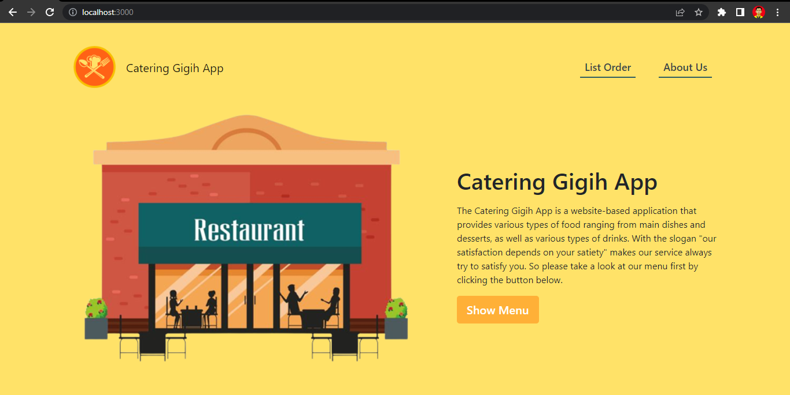
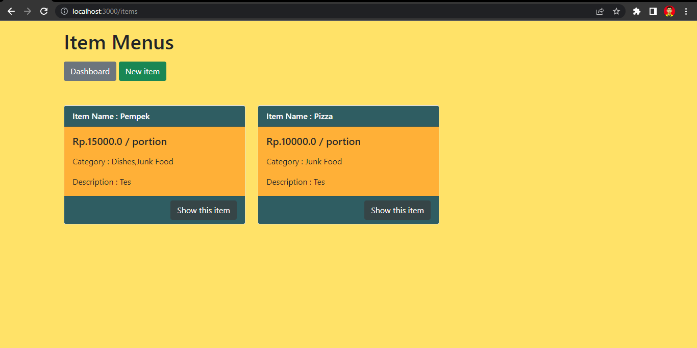
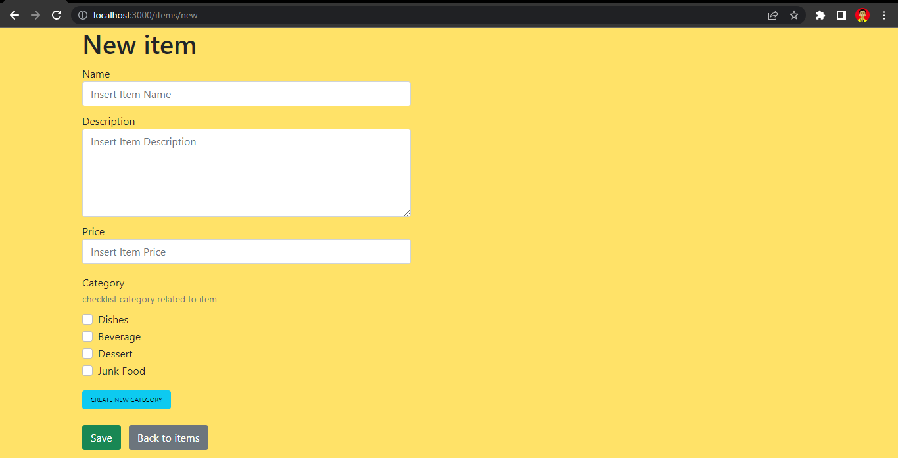
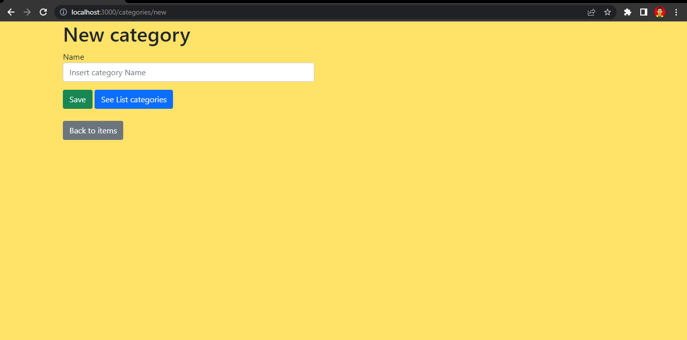
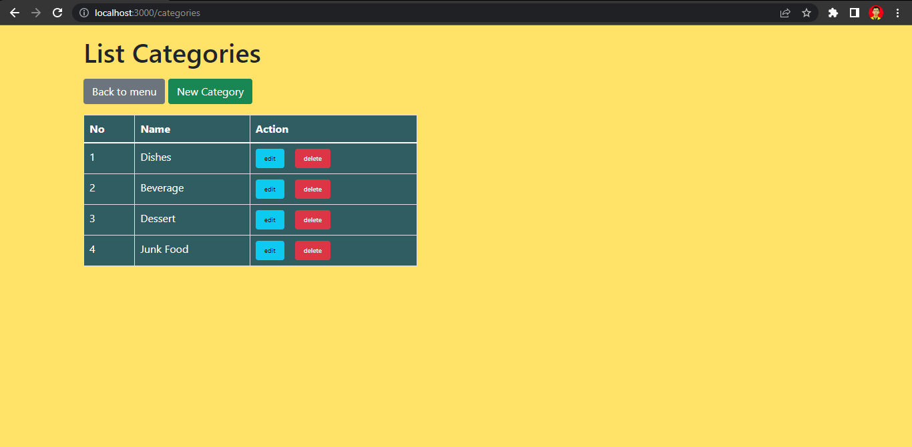
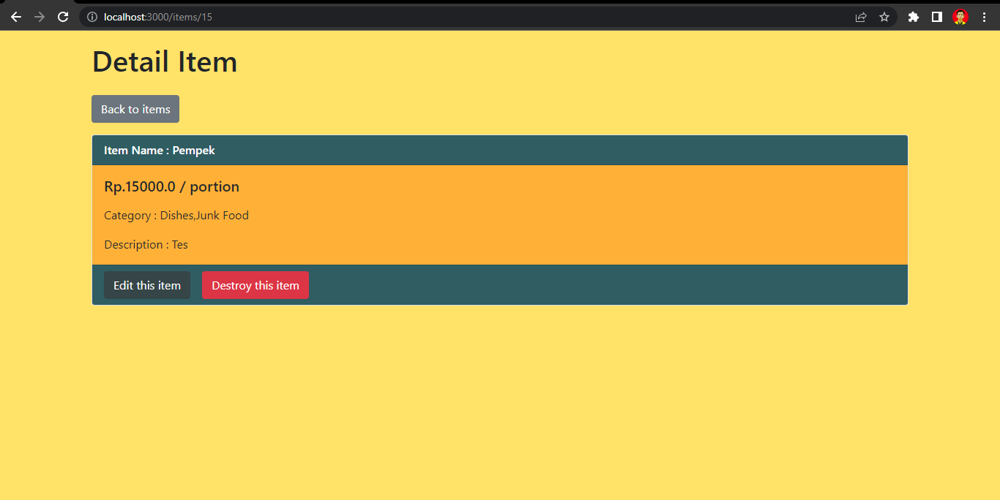
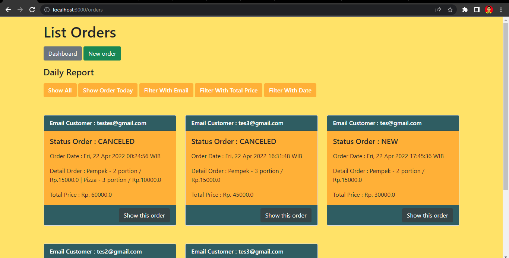
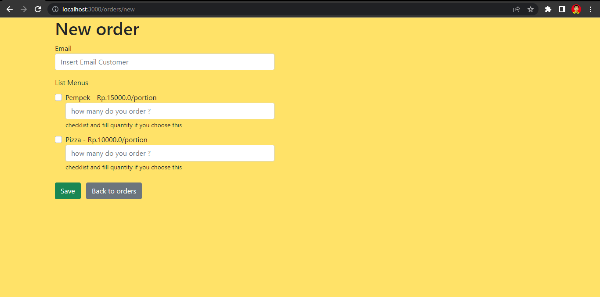
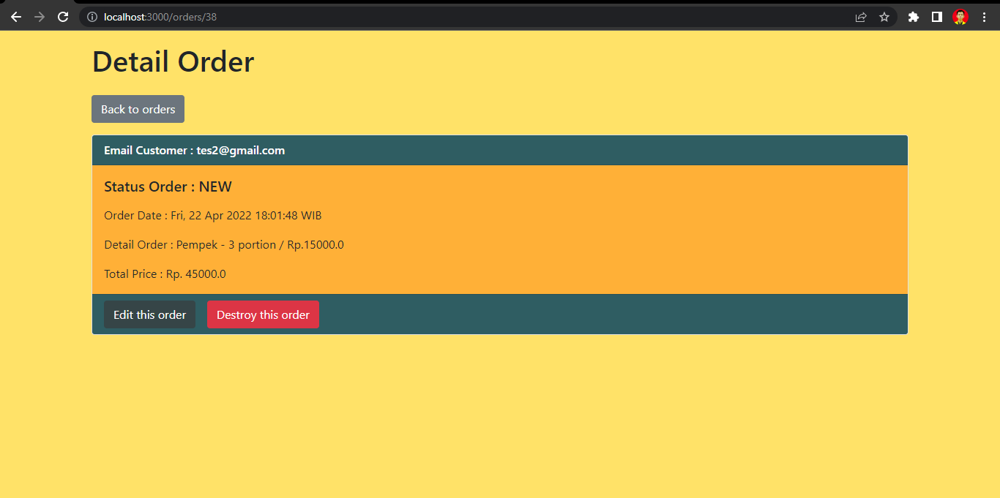
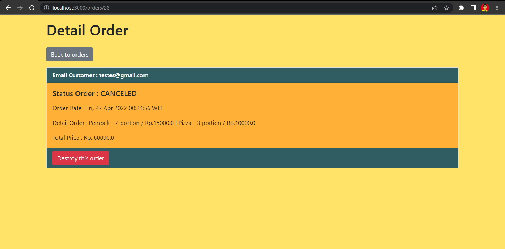

# Catering Gigih App Based Web-API

lihat disini demo aplikasi [Demo Aplikasi](https://youtu.be/M4CC8vJ92SQ)

Aplikasi tempat pemesanan aneka makanan dan minuman berbasis website dengan tampilan yang enak dipandang dan mudah digunakan tentunya dengan harga yang terjangkau. 

Proses bisnis dari aplikasi ini sebagai berikut:
- umumkan menu makanan minuman dan harga di Whatsapp
- customer pesan lewat Whatsapp dan bayar lewat TF bank
- owner mencatat pesanan customer di aplikasi
- jika belum bayar sampai jam 5 sore, pesanan customer batal
- setelah jam 5 lihat daftar pesanan yang telah dibayar dan siapkan makanan

## Menu yang tersedia pada aplikasi

### Items
pada menu ini berfungsi untuk menampilkan menu yang ada, menambah menu baru, mengubah informasi mengenai menu lama, dan menghapus menu yang tidak tersedia lagi

##### Tampilan Menu

##### Tampilan Tambah Menu

pada tampilan tambah menu terdapat fitur tambahan yaitu tambah kategori baru

##### Tampilan Detail Item

### Orders
pada menu ini berfungsi untuk menampilkan daftar pesanan, menambah pesanan baru, mengubah detail pesanan lama, dan menghapus pesanan lama

##### Tampilan Menu
pada menu ini berfungsi untuk menampilkan daftar pesanan bisa berdasarkan filter:
- semua pesanan
- semua pesanan pada hari tersebut
- semua pesanan berdasarkan email
- semua pesanan berdasarkan total harga
- semua makanan berdasarkan jarak tanggal

##### Tampilan Tambah Pesanan

##### Tampilan Detail Pesanan

ada fitur otomatis ketika lewat dari jam 5 dan status pesanan belum berubah menjadi PAID maka pesanan tersebut menjadi CANCELED. Jika pesanan statusnya CANCELED maka tidak bisa diubah lagi
ini gambar

---

## Requirement 

### Struktur Database
Tabel Item
- id integer auto increament primary key
- name string
- description string(150)
- price float
- created_at datetime
- updated_at datetime

Tabel Category
- id integer auto increament primary key
- name string
- created_at datetime
- updated_at datetime

Tabel Order
- id integer auto increament primary key
- email string
- status_order enum("NEW","PAID","CANCELED")
- total_price float
- created_at datetime
- updated_at datetime

Tabel OrderDetail
- id integer auto increament primary key
- order_id integer foreign key
- item_id integer foreign key
- price float
- quantity integer
- created_at datetime
- updated_at datetime

### Aktivitas untuk menu item
1. Buat menu item baru
        - terdiri dari nama, deskripsi, harga, categori
        - nama harus unik
        - harga tidak boleh lebih kecil dari 0.01
2. Update menu item yang ada
3. Tampilkan seluruh menu item
4. Delete menu item

### Aktivitas untuk pesanan pelanggan
1. Buat pesanan pelanggan
        - terdiri dari email dan item
        - email harus format yang valid
        - ketika pertama kali buat mempunyai status NEW
2. Update pesanan pelanggan
        - status menjadi PAID, jika customer konfirmasi bayaran sebelum jam 5 sore di WA
        - status CANCELED jika customer tidak membayar saat jam 5 sore
3. Buat daily report pesanan
        - menampilkan semua daftar pesanan beserta alamat email dan total harga pesanan
        - menampilkan semua daftar pesanan beserta alamat email dan total harga pesanan berdasarkan hari tersebut
        - menampilkan semua daftar pesanan beserta alamat email dan total harga pesanan berdasarkan email tertentu
        - menampilkan semua daftar pesanan beserta alamat email dan total harga pesanan berdasarkan total harga tertentu
        - menampilkan semua daftar pesanan beserta alamat email dan total harga pesanan berdasarkan rentang hari
